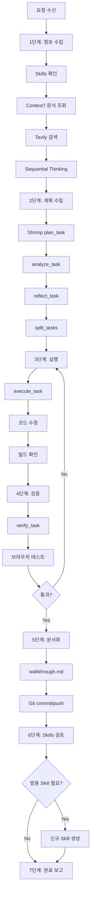

# /MCP-VSCODE 워크플로우

VSCode + GitHub Copilot 환경에서 사용 가능한 **모든 MCP**를 체계적으로 활용하는 워크플로우입니다.

> 사용자는 비개발자일 수 있으며, 결과만 설명할 수 있습니다. 원인 파악/영향 파일 탐색은 MCP 절차에 따라 AI가 주도적으로 수행해야 합니다.

---

## 0단계: MCP 도구 스냅샷 & 선택 로직 (최소화)

**목표:** 현재 세션에서 실제 사용 가능한 MCP 도구 목록을 먼저 확보하고, 그 범위 안에서만 선택한다.

### 0-1. 사용 가능 도구 조회
```
mcp_com_mermaidch_list_tools
```
- 세션당 1회만 수행 (동일 세션 재호출 금지)
- 결과에 없는 MCP는 **현재 세션에서 사용 불가**로 간주
- 문서에 있는 MCP라도 목록에 없으면 **기본 도구(read_file 등)**로 대체

### 0-2. 선택 로직 (우선순위 매트릭스)
| 작업 유형 | 우선 MCP | 대체 도구(없을 때) |
|---|---|---|
| 공식 문서 검증 | Context7 | 프로젝트 내 문서/README + grep_search |
| 최신 정보/트렌드 | Tavily | fetch_webpage + 내부 기록 |
| 복잡한 설계/분석 | Sequential Thinking | 단계별 체크리스트 수기 작성 |
| 태스크 계획/검증 | Shrimp Task Agent | 체크리스트(예외/대체) |
| 다이어그램 | Mermaid/Excalidraw | Markdown 텍스트 다이어그램 |
| 브라우저 검증 | Next.js Devtools | Playwright/로컬 수동 테스트 |
| 배포/DB 관리 | Vercel/Supabase | 배포 문서 + SQL 파일 수동 검토 |

### 0-3. 현재 세션에서 확인된 MCP (자동 갱신)
- Mermaid: validate_and_render_mermaid_diagram, get_diagram_title, get_diagram_summary
- Context7: resolve-library-id, query-docs
- Tavily: tavily-search, tavily-extract
- Sequential Thinking: sequentialthinking
- Shrimp Task Agent: plan_task, analyze_task, reflect_task, split_tasks, execute_task, verify_task
- Chrome DevTools MCP: 브라우저 검증 자동화 (사용자 선택 시)
- Next Devtools MCP: 브라우저 검증 자동화 (사용자 선택 시)
- Excalidraw / Penpot: 다이어그램 및 디자인 도구 (선택적)
- Vercel MCP: 배포 관리 (필요 시)

제외한 MCP:
- basic memory, firebase, supabase (현재 작업 범위에서 불필요)

검증 기준:
- Mermaid는 동일 세션 내 재조회 금지 (최초 1회 결과만 사용)
- 나머지는 VSCode 도구 선택 상태 및 최근 호출 성공 이력으로 확인

> 위 목록은 0-1 결과에 따라 갱신하며, 불일치 시 0-1 결과가 항상 우선이다.

---

## 사용 가능한 MCP 목록

| MCP | 용도 | 주요 도구 |
|-----|------|-----------|
| **Context7** | 라이브러리 공식 문서 조회 | `resolve-library-id`, `query-docs` |
| **Tavily** | 웹 검색, 최신 정보 | `tavily-search`, `tavily-extract` |
| **Sequential Thinking** | 복잡한 문제 단계별 분석 | `sequentialthinking` |
| **Shrimp Task Agent** | 태스크 분할 및 관리 | `plan_task`, `analyze_task`, `split_tasks`, `execute_task`, `verify_task` |
| **Mermaid** | 다이어그램 생성/렌더링 | `validate_and_render_mermaid_diagram` |
| **Excalidraw** | 다이어그램 생성 | `create-excalidraw-diagram` |
| **Supabase** | 데이터베이스 관리 | `search_docs`, `apply_migration`, `execute_sql` |
| **Vercel** | 배포 관리 | `list_projects`, `search_vercel_documentation` |
| **Next.js Devtools** | Next.js 개발 도구 | `nextjs_docs`, `browser_eval` |

---

## 📋 7단계 프로세스

### 1단계: 요구사항 분석 및 정보 수집

#### 1-1. Skills 확인 (⚠️ 최우선 - 토큰 최적화)
```
.agent/skills/ 폴더에서 관련 스킬 확인:
1. 해당 기술 스택 관련 스킬 존재 여부 확인
2. lastUpdated 날짜 확인 (SKILL.md 상단 메타데이터)
3. 관련 패턴/체크리스트 로드
```

**관련 스킬 예시**
- Liveblocks 세션 목록 이슈: `.agent/skills/liveblocks-session-registry/SKILL.md`

**Skills 활용 판단 기준**:
| 조건 | 행동 |
|------|------|
| Skills 존재 + 90일 이내 업데이트 | ✅ 바로 적용, Context7/Tavily 스킵 가능 |
| Skills 존재 + 90일 초과 | ⚠️ 1-2로 이동, 최신 여부 검증 필요 |
| Skills 미존재 또는 관련 정보 없음 | 🔍 1-2, 1-3 필수 실행 |

**왜 90일?**: 주요 라이브러리 마이너 업데이트 주기 (React, Next.js, Motion 등)

**참고**: Sequential Thinking은 Skills 상태와 무관하게 필요 시 사용

#### 1-2. Context7 - 공식 문서 조회 (조건부)
```
Skills가 없거나 오래된 경우에만 실행:
1. mcp_context7_resolve-library-id: 라이브러리 ID 확인
2. mcp_context7_query-docs: 공식 문서에서 Best Practices 조회
3. 기존 Skills와 비교 → 차이점 발견 시 6단계에서 업데이트
```

**⚠️ 중요**: 조회한 패턴은 반드시 코드에 적용!
- 조회만 하고 CSS로 대체하거나 무시 금지
- 예: Motion `whileHover` 조회 → 실제로 `motion.button` 사용

#### 1-3. Tavily - 최신 정보 검색 (조건부)
```
Skills가 없거나 최신 트렌드가 필요한 경우에만 실행:
mcp_tavily_tavily-search: 
- 최신 트렌드, 버그 픽스, 권장 패턴 검색
- 커뮤니티 베스트 프랙티스 확인
```

#### 1-4. Sequential Thinking - 문제 분석
```
mcp_sequentialthi_sequentialthinking:
- 복잡한 문제를 단계별로 분석
- 가설 설정 → 검증 → 결론 도출
```

#### 1-5. 🔍 결론 검증 단계 (⚠️ 필수)
> **Sequential Thinking에서 도출한 결론은 구현 전 반드시 검증**

**검증 절차:**
```
1. Context7 검증: 도출한 결론이 공식 문서 권장 패턴과 일치하는지 확인
   - mcp_context7_query-docs로 관련 API/패턴 조회
   
2. Tavily 검증: 커뮤니티 사례와 비교
   - mcp_tavily_tavily-search로 유사 문제 해결 사례 검색
   
3. 결론 확정 또는 수정
```

**판단 기준:**
| 상황 | 행동 |
|------|------|
| 결론 ≠ 공식 문서 | 공식 문서 우선 채택 |
| 결론 ≠ 커뮤니티 사례 | 양쪽 분석 후 최선책 선택 |
| 결론 = 공식 + 커뮤니티 | ✅ 검증 완료, 2단계로 진행 |

**⚠️ 검증 없이 구현 금지**: Sequential Thinking은 추론 도구일 뿐, 실제 문서/사례와 다를 수 있음

---

### 2단계: 작업 계획 수립 (Shrimp 사용 + 가드)

#### 2-1. Shrimp 계획 수립
```
1. plan_task → analyze_task → reflect_task → split_tasks
```

#### 2-1b. Shrimp 실행 가드 (반복 호출 방지)
```
- list_tasks로 상태 확인 후 execute_task 1회만 호출
- task가 in_progress면 execute_task 재호출 금지
- 완료 후 verify_task 1회만 호출
```

#### 2-2. 다이어그램 작성 (필수)
```
mcp_com_mermaidch_validate_and_render_mermaid_diagram:
- Before/After 아키텍처 시각화
- 데이터 흐름도, 컴포넌트 구조도
```

---

### 3단계: 작업 실행

#### 3-1. Skills 패턴 적용 확인 (⚠️ 필수)
```
코드 작성 전 확인:
1. 1단계에서 로드한 Skills 패턴이 적용되었는가?
2. Context7에서 조회한 공식 패턴이 적용되었는가?
3. CSS만으로 대체하지 않고 권장 라이브러리를 사용했는가?
```

**적용 체크리스트 예시**:
- [ ] Motion `whileHover`/`whileTap` 사용 (CSS transform 대신)
- [ ] Tailwind `field-sizing-content` 사용 (JS resize 대신)
- [ ] 아이콘 버튼에 `title` 또는 `aria-label` 포함

#### 3-2. Shrimp 기반 실행
```
- execute_task는 1회만 호출
- in_progress 상태에서는 실행 가이드 참고 후 코드 수정 진행
```

#### 3-3. 실시간 검증
```
- get_errors: 컴파일 에러 확인
- run_in_terminal: 빌드/테스트 실행
```

---

### 4단계: 검증 및 테스트

#### 4-1. Shrimp 기반 검증
```
- verify_task 1회 호출
- 보완이 필요한 경우에만 추가 수정
```

#### 4-2. 브라우저 테스트 (UI 변경 시)
```
mcp_next-devtools_browser_eval:
- 실제 브라우저에서 렌더링 확인
- 콘솔 에러 확인
```

#### 4-3. 배포 확인 (Vercel)
```
mcp_com_vercel_ve_list_projects: 프로젝트 상태 확인
mcp_com_vercel_ve_search_vercel_documentation: 배포 이슈 해결
```

---

### 5단계: 문서화 및 커밋

#### 5-1. 변경사항 정리
```
- 새 문서 생성은 사용자 요청 시에만 수행
- 기본은 채팅 내 요약으로 대체
```

#### 5-2. Git 커밋 및 푸시
```
- 의미 있는 커밋 메시지 작성
- Conventional Commits 형식 준수
```

---

### 6단계: Skills 검토 및 생성 🆕

#### 6-1. Skills 업데이트 필요 여부 확인
작업 중 Context7/Tavily를 사용했다면:

| 상황 | 행동 |
|------|------|
| 기존 Skills와 다른 패턴 발견 | 해당 SKILL.md 업데이트, `lastUpdated` 갱신 |
| 새로운 기술/라이브러리 사용 | 신규 SKILL.md 생성 |
| Skills 90일 이상 경과 | `lastUpdated` 확인 후 갱신 |

#### 6-2. 범용 Skills 필요성 검토
작업 완료 후 다음을 검토:

| 검토 항목 | 질문 |
|----------|------|
| **반복 패턴** | 이 작업에서 반복적으로 적용한 패턴이 있는가? |
| **실수 방지** | 이 작업에서 발생한 실수가 다른 프로젝트에서도 발생할 수 있는가? |
| **Best Practice** | 공식 문서에서 발견한 규칙이 다른 프로젝트에도 적용되는가? |
| **디버깅 팁** | 이 작업에서 발견한 디버깅 방법이 범용적인가? |

#### 6-3. Skills 생성 기준
다음 조건 중 2개 이상 충족 시 신규 Skill 생성:

1. ✅ **범용성**: 2개 이상의 프로젝트에 적용 가능
2. ✅ **반복성**: 동일한 실수가 반복될 가능성 높음
3. ✅ **복잡성**: 공식 문서만으로 파악하기 어려운 함정 존재
4. ✅ **시간 절약**: 매번 조사하는 것보다 문서화가 효율적

#### 6-4. Skill 파일 구조 (⚠️ lastUpdated 필수!)
```markdown
---
name: [스킬 이름]
description: [한 줄 설명]
lastUpdated: YYYY-MM-DD  # ⚠️ 필수! 90일 기준 판단에 사용
source: [출처 - Context7, Tavily, 경험 등]
applies_to: [적용 대상 - 기술 스택, 프레임워크]
---

# [스킬 제목]

## 핵심 규칙
- 규칙 1
- 규칙 2

## ✅ 올바른 예시 (DO)
```code
// 예시
```

## ❌ 잘못된 예시 (DON'T)
```code
// 예시
```

## 적용 체크리스트
- [ ] 항목 1
- [ ] 항목 2
```

---

## 📁 Skills 폴더 구조

```
.agent/skills/
├── sdk-version-check/        # SDK 버전 체크
├── doc-guided-optimization/  # 문서 기반 최적화
├── google-genai-sdk/         # Gemini SDK 규칙
├── gemini-function-calling/  # Function Calling 스키마
├── culture-map-ai/           # Culture-MAP 전용
├── css-theming/              # 🆕 CSS 테마/다크모드 규칙 (예정)
└── ui-accessibility/         # 🆕 UI 접근성 규칙 (예정)
```

---

## 7단계: 완료 보고
- 변경 사항 요약
- 검증 결과 요약
- 다음 액션 제안

---

## 🔄 프로세스 플로우차트



---

## ⚠️ 주의사항

### MCP 사용 순서
1. **Context7 우선**: 항상 공식 문서 먼저 확인
2. **Tavily 보조**: 공식 문서에 없는 최신 정보 검색
3. **Sequential Thinking**: 복잡한 결정이 필요할 때만

### Skills 관리
- `.cursor/rules/`는 Cursor IDE 전용 (deprecated)
- `.agent/skills/`가 범용 위치 (VSCode/GitHub 호환)
- 신규 Skill 생성 시 MCP.md에 참조 추가

### 태스크 관리
- Shrimp Task Agent의 태스크는 세션 간 유지됨
- `clearAllTasks` 모드로 새 작업 시작 권장
- 완료된 태스크는 즉시 `verify_task` 호출
