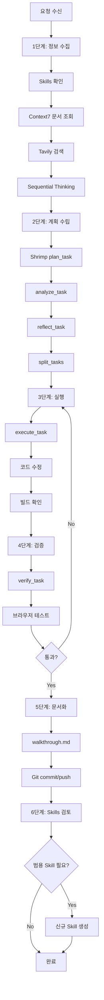

# /MCP-VSCODE 워크플로우

VSCode + GitHub Copilot 환경에서 사용 가능한 **모든 MCP**를 체계적으로 활용하는 워크플로우입니다.

---

## 사용 가능한 MCP 목록

| MCP | 용도 | 주요 도구 |
|-----|------|-----------|
| **Context7** | 라이브러리 공식 문서 조회 | `resolve-library-id`, `query-docs` |
| **Tavily** | 웹 검색, 최신 정보 | `tavily-search`, `tavily-extract` |
| **Sequential Thinking** | 복잡한 문제 단계별 분석 | `sequentialthinking` |
| **Shrimp Task Agent** | 태스크 분할 및 관리 | `plan_task`, `analyze_task`, `split_tasks`, `execute_task`, `verify_task` |
| **Mermaid** | 다이어그램 생성/렌더링 | `validate_and_render_mermaid_diagram` |
| **Excalidraw** | 다이어그램 생성 | `create-excalidraw-diagram` |
| **Supabase** | 데이터베이스 관리 | `search_docs`, `apply_migration`, `execute_sql` |
| **Vercel** | 배포 관리 | `list_projects`, `search_vercel_documentation` |
| **Next.js Devtools** | Next.js 개발 도구 | `nextjs_docs`, `browser_eval` |

---

## 📋 6단계 프로세스

### 1단계: 요구사항 분석 및 정보 수집

#### 1-1. Skills 확인 (필수)
```
.agent/skills/ 폴더에서 관련 스킬 확인
- 해당 기술 스택 관련 스킬 존재 여부
- 기존 규칙 및 패턴 로드
```

#### 1-2. Context7 - 공식 문서 조회 (필수)
```
1. mcp_context7_resolve-library-id: 라이브러리 ID 확인
2. mcp_context7_query-docs: 공식 문서에서 Best Practices 조회
```

#### 1-3. Tavily - 최신 정보 검색
```
mcp_tavily_tavily-search: 
- 최신 트렌드, 버그 픽스, 권장 패턴 검색
- 커뮤니티 베스트 프랙티스 확인
```

#### 1-4. Sequential Thinking - 문제 분석
```
mcp_sequentialthi_sequentialthinking:
- 복잡한 문제를 단계별로 분석
- 가설 설정 → 검증 → 결론 도출
```

---

### 2단계: 작업 계획 수립

#### 2-1. Shrimp Task Agent 활용
```
1. mcp_mcp-shrimp-ta_plan_task: 태스크 계획 시작
2. mcp_mcp-shrimp-ta_analyze_task: 기술적 분석
3. mcp_mcp-shrimp-ta_reflect_task: 아키텍처 검증
4. mcp_mcp-shrimp-ta_split_tasks: 태스크 분할
```

#### 2-2. 다이어그램 작성 (아키텍처 변경 시)
```
mcp_com_mermaidch_validate_and_render_mermaid_diagram:
- Before/After 아키텍처 시각화
- 데이터 흐름도, 컴포넌트 구조도
```

---

### 3단계: 작업 실행

#### 3-1. 태스크별 실행
```
mcp_mcp-shrimp-ta_execute_task: 
- 태스크 ID로 실행 가이드 확인
- 단계별 구현
```

#### 3-2. 실시간 검증
```
- get_errors: 컴파일 에러 확인
- run_in_terminal: 빌드/테스트 실행
```

---

### 4단계: 검증 및 테스트

#### 4-1. 태스크 검증
```
mcp_mcp-shrimp-ta_verify_task:
- 검증 기준 충족 확인
- 점수 부여 및 완료 처리
```

#### 4-2. 브라우저 테스트 (UI 변경 시)
```
mcp_next-devtools_browser_eval:
- 실제 브라우저에서 렌더링 확인
- 콘솔 에러 확인
```

#### 4-3. 배포 확인 (Vercel)
```
mcp_com_vercel_ve_list_projects: 프로젝트 상태 확인
mcp_com_vercel_ve_search_vercel_documentation: 배포 이슈 해결
```

---

### 5단계: 문서화 및 커밋

#### 5-1. 변경사항 정리
```
.agent/brain/ 폴더에 문서 생성:
- implementation_plan.md: 구현 계획
- task.md: 작업 체크리스트
- walkthrough.md: 완료 보고서
```

#### 5-2. Git 커밋 및 푸시
```
- 의미 있는 커밋 메시지 작성
- Conventional Commits 형식 준수
```

---

### 6단계: Skills 검토 및 생성 🆕

#### 6-1. 범용 Skills 필요성 검토
작업 완료 후 다음을 검토:

| 검토 항목 | 질문 |
|----------|------|
| **반복 패턴** | 이 작업에서 반복적으로 적용한 패턴이 있는가? |
| **실수 방지** | 이 작업에서 발생한 실수가 다른 프로젝트에서도 발생할 수 있는가? |
| **Best Practice** | 공식 문서에서 발견한 규칙이 다른 프로젝트에도 적용되는가? |
| **디버깅 팁** | 이 작업에서 발견한 디버깅 방법이 범용적인가? |

#### 6-2. Skills 생성 기준
다음 조건 중 2개 이상 충족 시 신규 Skill 생성:

1. ✅ **범용성**: 2개 이상의 프로젝트에 적용 가능
2. ✅ **반복성**: 동일한 실수가 반복될 가능성 높음
3. ✅ **복잡성**: 공식 문서만으로 파악하기 어려운 함정 존재
4. ✅ **시간 절약**: 매번 조사하는 것보다 문서화가 효율적

#### 6-3. Skill 파일 구조
```markdown
---
name: [스킬 이름]
description: [한 줄 설명]
source: [출처 - Context7, Tavily, 경험 등]
applies_to: [적용 대상 - 기술 스택, 프레임워크]
---

# [스킬 제목]

## 핵심 규칙
- 규칙 1
- 규칙 2

## ✅ 올바른 예시 (DO)
```code
// 예시
```

## ❌ 잘못된 예시 (DON'T)
```code
// 예시
```

## 체크리스트
- [ ] 항목 1
- [ ] 항목 2
```

---

## 📁 Skills 폴더 구조

```
.agent/skills/
├── sdk-version-check/        # SDK 버전 체크
├── doc-guided-optimization/  # 문서 기반 최적화
├── google-genai-sdk/         # Gemini SDK 규칙
├── gemini-function-calling/  # Function Calling 스키마
├── culture-map-ai/           # Culture-MAP 전용
├── css-theming/              # 🆕 CSS 테마/다크모드 규칙 (예정)
└── ui-accessibility/         # 🆕 UI 접근성 규칙 (예정)
```

---

## 🔄 프로세스 플로우차트



---

## ⚠️ 주의사항

### MCP 사용 순서
1. **Context7 우선**: 항상 공식 문서 먼저 확인
2. **Tavily 보조**: 공식 문서에 없는 최신 정보 검색
3. **Sequential Thinking**: 복잡한 결정이 필요할 때만

### Skills 관리
- `.cursor/rules/`는 Cursor IDE 전용 (deprecated)
- `.agent/skills/`가 범용 위치 (VSCode/GitHub 호환)
- 신규 Skill 생성 시 MCP.md에 참조 추가

### 태스크 관리
- Shrimp Task Agent의 태스크는 세션 간 유지됨
- `clearAllTasks` 모드로 새 작업 시작 권장
- 완료된 태스크는 즉시 `verify_task` 호출
