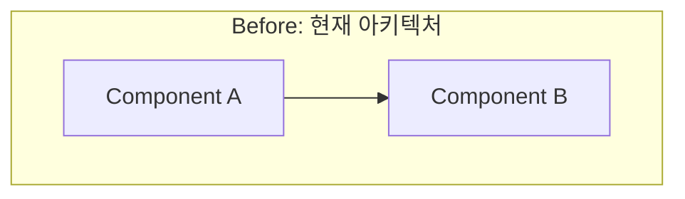
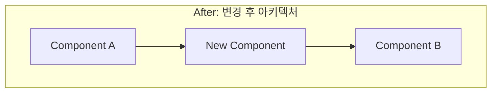

# /MCP 워크플로우

Sequential Thinking, Tavily, Context7 MCP를 활용한 체계적 개발 워크플로우입니다.

---

## 1단계: 지시 의도 심층분석

### 1-1. 코드베이스 탐색
// turbo
- `list_dir`와 `view_file_outline`으로 프로젝트 구조 파악
- 핵심 파일 및 의존성 확인

### 1-1b. SDK/라이브러리 및 문서 기반 최적화 ⚠️ 필수
// turbo
- **기존 코드를 신뢰하지 말 것** - 반드시 최신 공식 문서와 대조하여 최적의 패턴 확인
- **Skill 참조**: 
  - `.agent/skills/sdk-version-check/SKILL.md` (버전 및 Depreation 체크)
  - `.agent/skills/doc-guided-optimization/SKILL.md` (최신 패턴 및 성능 최적화)
- 외부 API/SDK 사용 코드는 최신 권장 사항(Best Practices) 준수 여부 확인
- 특히 실시간 협업(Liveblocks) 및 AI SDK는 릴리즈 주기가 빠르므로 2025 하반기 기준 최신 문서 필독

### 1-2. MCP 기반 분석 (순서 중요)
1. **Context7** 먼저 사용 - 관련 라이브러리/프레임워크 문서 조회
   - `mcp_context7_resolve-library-id` → `mcp_context7_query-docs`
2. **Tavily** 사용 - 최신 정보, 베스트 프랙티스 검색
   - `mcp_tavily_tavily-search` 또는 `mcp_tavily_tavily-extract`
3. **Sequential Thinking** 사용 - 복잡한 문제 분석
   - `mcp_sequential-thinking_sequentialthinking`

### 1-3. 역할/작업 정의
- 사용자가 비개발자임을 고려하여 누락된 필수 작업 식별
- 기술적 요구사항을 구체적으로 정의

### 1-4. 리스크 평가
- **치명적 영향 가능성 검토**:
  - 기존 데이터 손실 위험
  - Breaking changes 여부
  - 보안 취약점 발생 가능성
  - 성능 저하 우려
- ⚠️ 리스크 발견 시 → **사용자에게 질의 후 진행**

---

## 2단계: 작업 계획 수립

### 2-1. implementation_plan.md 작성
```
아티팩트 경로: <appDataDir>/brain/<conversation-id>/implementation_plan.md
```
- 목표 설명
- 사용자 검토 필요 항목 (있는 경우)
- 컴포넌트별 변경 사항 (파일 단위)

### 2-2. 📊 시각적 다이어그램 (아키텍처 변경 시 필수)

**Mermaid 다이어그램**으로 Before/After 시각화:





**다이어그램 유형 가이드:**
| 변경 유형 | 권장 다이어그램 |
|----------|----------------|
| 데이터 흐름 변경 | `flowchart` / `graph` |
| 시퀀스/API 호출 | `sequenceDiagram` |
| 상태 변화 | `stateDiagram-v2` |
| 클래스/컴포넌트 구조 | `classDiagram` |
| 타임라인/마일스톤 | `timeline` |

### 2-3. 🔄 롤백 계획 (중요 변경 시 필수)

**롤백 전략 체크리스트:**
- [ ] **Git 브랜치 전략**: feature 브랜치에서 작업, main 보호
- [ ] **데이터 백업**: 기존 데이터 내보내기/스냅샷
- [ ] **단계적 마이그레이션**: 한 번에 하나의 주요 변경
- [ ] **Feature Flag**: 새 기능 토글 가능하게 구현
- [ ] **롤백 스크립트**: 되돌리기 명령어 문서화

**롤백 시나리오 템플릿:**
```markdown
## 롤백 시나리오: [기능명]

### 트리거 조건
- 조건 1: [언제 롤백할지]
- 조건 2: [어떤 오류가 발생하면]

### 롤백 절차
1. `git revert <commit-hash>` 또는 `git checkout <branch>`
2. [추가 데이터 복구 절차]
3. [서비스 재시작 명령어]

### 영향 범위
- 영향 받는 컴포넌트: [목록]
- 예상 다운타임: [시간]
```

### 2-4. 검증 계획 포함
- 자동화 테스트 명령어
- 수동 검증 항목
- 롤백 테스트 (선택적)

### 2-5. 사용자 승인
- `notify_user`로 implementation_plan.md 리뷰 요청
- 승인 전까지 대기

---

## 3단계: 작업 세분화

### 3-1. task.md 작성
```
아티팩트 경로: <appDataDir>/brain/<conversation-id>/task.md
```
- `[ ]` 미완료 작업
- `[/]` 진행 중 작업  
- `[x]` 완료 작업
- 하위 항목으로 세부 작업 분류

### 3-2. 작업 우선순위 설정
- 의존성 순서대로 배치
- 롤백 가능한 단위로 분할

---

## 4단계: 단계별 작업 수행

### 4-1. task_boundary 활용
- 각 주요 작업 단위마다 `task_boundary` 호출
- Mode: PLANNING → EXECUTION → VERIFICATION

### 4-2. 진행률 추적
- task.md 실시간 업데이트
- 완료된 항목 `[x]`로 마킹

### 4-3. 중간 검증
- 주요 마일스톤마다 테스트 실행
- 문제 발견 시 즉시 수정

---

## 5단계: 완료 및 문서화

### 5-1. walkthrough.md 작성
```
아티팩트 경로: <appDataDir>/brain/<conversation-id>/walkthrough.md
```
- 완료된 변경 사항 요약
- 테스트 결과
- 스크린샷/녹화 (UI 변경 시)

### 5-2. 최종 검증
- 전체 빌드 테스트
- 주요 기능 동작 확인

### 5-3. 사용자 알림
- `notify_user`로 walkthrough.md 리뷰 요청

---

## MCP 도구 빠른 참조

| MCP | 용도 | 주요 도구 |
|-----|------|-----------|
| **Context7** | 라이브러리 문서 조회 | `resolve-library-id`, `query-docs` |
| **Tavily** | 웹 검색, 콘텐츠 추출 | `tavily-search`, `tavily-extract`, `tavily-crawl` |
| **Sequential Thinking** | 복잡한 문제 단계별 분석 | `sequentialthinking` |
| **Firebase** | Firebase 프로젝트 관리 | `firebase_get_project`, `firebase_init` |
| **Mermaid** | 다이어그램 생성/렌더링 | `render`, `validate`, `save` |

---

## 📦 MCP 설치 가이드

### 필수 MCP 서버

#### 1. Context7 (라이브러리 문서)
```json
{
  "context7": {
    "command": "npx",
    "args": ["-y", "@context7/mcp-server"]
  }
}
```

#### 2. Tavily (웹 검색)
```json
{
  "tavily": {
    "command": "npx",
    "args": ["-y", "tavily-mcp"],
    "env": {
      "TAVILY_API_KEY": "your-api-key"
    }
  }
}
```
> 🔗 API 키: https://tavily.com에서 발급

#### 3. Sequential Thinking (문제 분석)
```json
{
  "sequential-thinking": {
    "command": "npx",
    "args": ["-y", "@anthropic/mcp-sequential-thinking"]
  }
}
```

#### 4. Firebase (프로젝트 관리)
```json
{
  "firebase-mcp-server": {
    "command": "npx",
    "args": ["-y", "firebase-mcp", "--dir", "."]
  }
}
```

#### 5. Mermaid (다이어그램) - 원격 서버 사용
```json
{
  "mermaid": {
    "command": "npx",
    "args": ["-y", "mcp-remote", "https://mcp.mermaid.ai/mcp"]
  }
}
```

### 설정 파일 위치
- **Windows**: `%APPDATA%\Code\User\globalStorage\anthropic.claude-vscode\settings\mcp_settings.json`
- **macOS**: `~/Library/Application Support/Code/User/globalStorage/anthropic.claude-vscode/settings/mcp_settings.json`
- **Antigravity IDE**: MCP 설정 패널에서 직접 추가

---

// turbo-all
